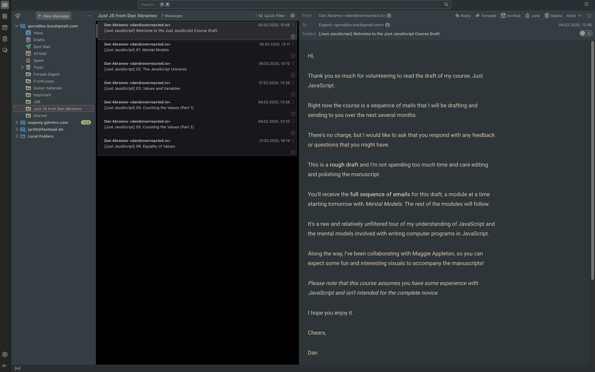
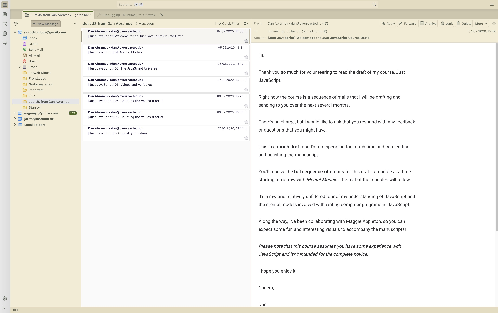

# 🌲 Everforest Night for Thunderbird

A green-based theme for Thunderbird, designed to stay warm and readable during long coding sessions

### Dark Mode

### Light Mode

## Installation

### From Thunderbird Add-ons

1. Open **Add-ons Manager** (`Ctrl+Shift+A` / `Cmd+Shift+A`)
2. Search for **Everforest Night**
3. Click **Install**

### Manual

1. Download the latest `.xpi` from [Releases](https://github.com/jarith/everforest-night-thunderbird/releases)
2. In Thunderbird, open **Add-ons Manager** (`Ctrl+Shift+A` / `Cmd+Shift+A`)
3. Click the gear icon > **Install Add-on From File...**
4. Select the downloaded `.xpi` file

## Color Palette

### Dark Colors

| Color      | Hex       | Preview                                                       |
| ---------- | --------- | ------------------------------------------------------------- |
| Background | `#323d43` |  |
| Foreground | `#d8caac` |  |
| Grey       | `#b0bab0` |  |
| Red        | `#eda0a1` |  |
| Green      | `#a7c080` |  |
| Aqua       | `#83c092` |  |
| Blue       | `#86bfb7` |  |

### Light Colors

| Color      | Hex       | Preview                                                       |
| ---------- | --------- | ------------------------------------------------------------- |
| Background | `#f3ebd2` |  |
| Foreground | `#4f5b62` |  |
| Grey       | `#495247` |  |
| Red        | `#ad3b4a` |  |
| Green      | `#47661b` |  |
| Aqua       | `#2c7459` |  |
| Blue       | `#2e7099` |  |

## Acknowledgments

Inspired by [Forest Night](https://github.com/jef/forest-night-jetbrains) by [@jef](https://github.com/jef) and [Everforest](https://github.com/sainnhe/everforest-vscode) by [@sainnhe](https://github.com/sainnhe)

## License

[MIT](LICENSE)
